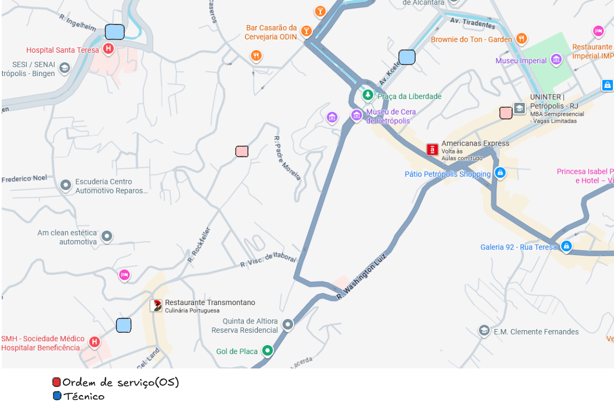
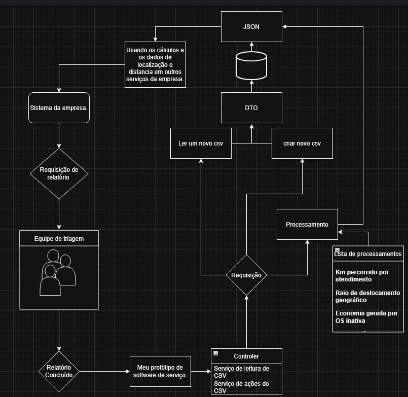

# Protótipo Estudantil de Sistema de Cálculos Baseado em Triagem de Ordens de Serviço

>Este projeto consiste em um protótipo de sistema desenvolvido a partir da análise de um processo real de triagem de o.s(**ordens de serviço**) em ambiente corporativo. A proposta surgiu a partir da observação de como os **relatórios** diários de clientes são tratados pela empresa, especialmente nos casos em que há a possibilidade de o atendimento técnico não ser necessário.Atualmente, a empresa gera diariamente um **relatório contendo clientes que potencialmente não precisarão de reparo. Esse material é analisado por uma equipe de triagem responsável por avaliar cada caso e atualizar o status das ordens de serviço**, evitando deslocamentos desnecessários de técnicos. Apesar de esse processo já gerar economia operacional, não existe hoje uma forma estruturada de mensurar, com precisão, os custos evitados por essas decisões.
Além disso, também foi identificado que não há um mecanismo automatizado que permita analisar a posição geográfica dos técnicos em relação às ordens de serviço. Em muitos casos, seria possível otimizar a operação escolhendo o profissional mais próximo do local de atendimento, reduzindo tempo de deslocamento e custos logísticos.**Diante desse cenário, o protótipo foi idealizado com dois objetivos principais: primeiro, calcular e consolidar os valores de gastos evitados a partir das decisões de triagem; segundo, utilizar dados de geolocalização para identificar o técnico mais próximo de cada ordem de serviço, permitindo uma alocação mais eficiente dos recursos em campo**.



---

## 📸 Preview

> 

---

## ✨ Funcionalidades

### 📋 Gestão de Ordens de Serviço (OS)

- ✅ Criação de ordens de serviço manualmente via API
- ✅ Criação de múltiplas OS a partir de upload de arquivo CSV
- ✅ Listagem de todas as ordens de serviço cadastradas
- ✅ Consulta de OS por número identificador
- ✅ Listagem de ordens de serviço ativas
- ✅ Inativação de ordens de serviço
- ✅ Associação de técnicos a uma OS

---

### 📂 Importação de Dados via CSV

- ✅ Upload de arquivos CSV contendo ordens de serviço
- ✅ Processamento automático dos dados
- ✅ Criação em lote de OS a partir do arquivo

---

### 📍 Geolocalização e Distância

- ✅ Cálculo de distância entre dois pontos geográficos (latitude/longitude)
- ✅ Cálculo de distância entre técnico e ordem de serviço
- ✅ Suporte a análise de proximidade para logística de atendimento

---

### 💰 Controle de Custos e Despesas

- ✅ Cálculo do valor total acumulado das ordens de serviço
- ✅ Verificação de custos evitados ao atribuir um técnico a uma OS

---

###  Processos de Negócio Automatizados

- ✅ Regras de negócio centralizadas na camada de serviço (`CentralService`)
- ✅ Processamento automático de dados vindos de CSV
- ✅ Atualização de status de ordens de serviço

---

### 🛠️ Ferramentas Utilizadas no Projeto

- Java 17  
- Spring Boot 3.4.3  
- Spring Data JPA  
- Hibernate (ORM)  
- Banco de Dados H2 (ambiente de protótipo)  
- API de Geolocalização: [Geoapify](https://www.geoapify.com/)  
---

##  Executando o Projeto com Docker

O projeto pode ser executado de forma totalmente isolada utilizando Docker e Docker Compose.

#### Pré-requisitos

- Docker e Docker Compose instalados

---

### 🚀 Passo a passo

```bash
# 1. Clonar o repositório
git clone https://github.com/NathancruzDev/CsvAlloha

# 2. Acessar a pasta do projeto
cd CsvAlloha/demo

# 3. Buildar e subir os containers
docker-compose up --build

# 4. Acessar no navegador a rota: 
http://localhost:8081/swagger-ui/index.html#/

#5. Acessar o arquivo CSV de teste nas docs do projeto

```


## Desenvolvido por **NathanCruzDev**

- GitHub: https://github.com/NathancruzDev
- LinkedIn: https://www.linkedin.com/in/nathan-leite-da-cruz-sangy-2bb363329/
